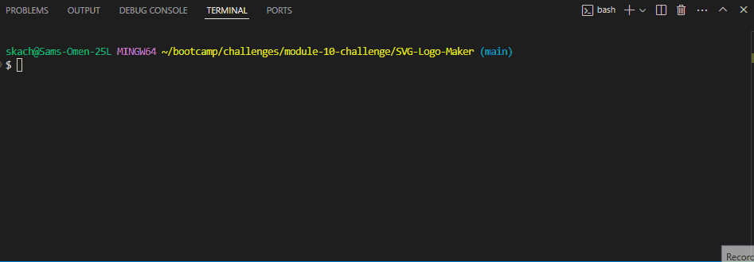

# SVG Logo Generator

## Description

The Logo Generator CLI is a simple command-line tool designed to help freelance web developers and hobbyists create custom logos quickly and efficiently. The motivation behind this project was to eliminate the need to hire a graphic designer for creating basic logos, thereby saving time and resources. This project was built to automate the logo creation process, allowing users to generate SVG logos with customized text and shapes in just a few steps.

This project solves the problem of needing a fast, easy, and cost-effective way to create logos without any design skills. Throughout the development of this project, I learned more about handling user input in a command-line environment, generating SVG files programmatically, and writing unit tests for JavaScript applications.

## Table of Contents

- [Installation](#installation)
- [Usage](#usage)
- [Credits](#credits)
- [License](#license)
- [Badges](#badges)
- [Features](#features)
- [How to Contribute](#how-to-contribute)
- [Tests](#tests)

## Installation

To install and set up the Logo Generator CLI, follow these steps:

1. Clone the repository:
    ```bash
    git clone https://github.com/ogchromebook/SVG-Logo-Maker
    ```

2. Navigate to the project directory:
    ```bash
    cd SVG-Logo-Maker
    ```

3. Install the necessary dependencies:
    ```bash
    npm install
    ```

## Usage

To use the Logo Generator CLI, follow these steps:

1. Run the application using the following command:
    ```bash
    npm start
    ```

2. Follow the prompts to input:
    - Up to three characters of text.
    - A color for the text (keyword or hexadecimal).
    - A shape (circle, triangle, or square).
    - A color for the shape (keyword or hexadecimal).

3. Once all inputs are provided, an SVG file named `logo.svg` will be generated in the project directory.

4. Open the `logo.svg` file in a web browser to view your custom logo.

Example of process and generated logo:




## Credits

- **Inquirer** - [Inquirer.js](https://github.com/SBoudrias/Inquirer.js) for handling user prompts.
- **Jest** - [Jest](https://jestjs.io/) for testing the application.
- Special thanks to the open-source community for providing great tools and libraries.

## License

This project is licensed under the MIT License. For more details, see the [LICENSE](LICENSE) file.

---

🏆

## Badges


## Features

- Generate custom logos in SVG format.
- Supports text customization with up to three characters.
- Offers multiple shapes (circle, triangle, square) and colors.
- Easy to use and set up via the command line.

## How to Contribute

Contributions are welcome! If you would like to contribute to this project, please fork the repository, make your changes, and submit a pull request. For major changes, please open an issue first to discuss what you would like to change.

## Tests

To run the tests for this application, use the following command:

```bash
npm test
